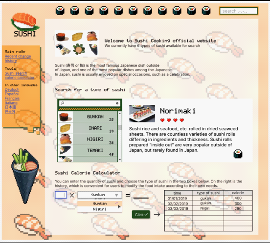
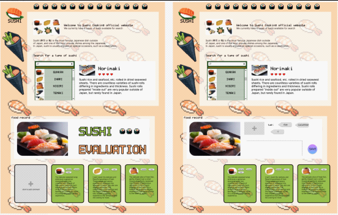

# Sushipigibiuti_shni3750

## Table of Contents
- description
- Features
- Getting started
- Feedback and Support
- Iteration
- Development progress

## Description
Sushipigibiuti is a web-based application designed to help you easily track and manage your sushi eating experience. Whether you're a sushi lover or just starting to explore this delightful cuisine, Sushipigibiuti provides a convenient platform to record and analyze your sushi experience.

## Feature
feature Sushi Log: Easily log your sushi meals, including details like date, type of sushi, and rating.
Meal History: Track all recorded sushi meals in one place. Sushipigibiuti displays your dining history in record order, allowing you to relive past experiences and cherish memories.
Statistics: Gain insight into your sushi eating habits through visualizations. Sushipigibiuti offers recording features to help you analyze your preferences, identify trends, and make informed choices for your future sushi journeys.

## Getting Started
To get started with Sushipigibiuti, follow these simple steps:
1. The webpage is divided into three distinct sections: an introduction to the webpage itself, a comprehensive overview of various sushi options, and a dedicated area for recording sushi scores.
2. In the second section, users who have yet to experience sushi can explore and learn about different types of sushi, enabling them to venture into new culinary experiences.
3. Following the sushi tasting experience, users can select an accompanying picture and add relevant tags for record-keeping purposes. Additionally, they have the option to include timestamps and comments to further enhance their record.

## Feedback and Support
If you encounter any issues while using Sushipigibiuti or have any suggestions for improvement, please send e-mail to me at shni3750@uni.sydney.edu.au. I appreciate your feedback and are committed to providing the best user experience possible.

## Iteration
Before modification

New high-fidelity

### Modification:
The original third part I wanted to design a calculator that records calories, but it did not meet the needs of tracking and recording. I reworked the design and created a new feature that records sushi types and viewing history.

## Development progress
Sushipigibiuti has gone through an iterative development process to ensure the highest quality and best user experience. This section outlines the major milestones, iterations, and improvements during development.

**Milestone 1:** Initial Planning and Prototyping
In the initial stages of development, I do research to understand the requirements and extend them. Explore and observe existing food websites to confirm general design direction. Based on observations, I created wireframes and prototypes to visualize user interface and user flow.

**Milestone 2:** With the wireframes and prototypes finalized, I started the development process. I chose css, html as well as js to ensure a scalable and efficient solution. At this stage, I collected a lot of sushi images and designed some pixelated sushi patterns in preparation for the webpage.

**Milestone 3:** In parallel with front-end development and UI improvements, I started implementing UI design. I'm also focusing on usability and responsiveness, making sure Sushipigibiuti is accessible across different devices and screen sizes. I did a small amount of user testing (discussions among classmates) and gathered feedback to iterate on the UI design. I improved the layout, color scheme, and interaction modes to create an intuitive and visually appealing experience.

**Milestone 4:** Iterative Development and User Feedback
Throughout the development process, I took an iterative approach, constantly searching for better interface changes and making modifications.
